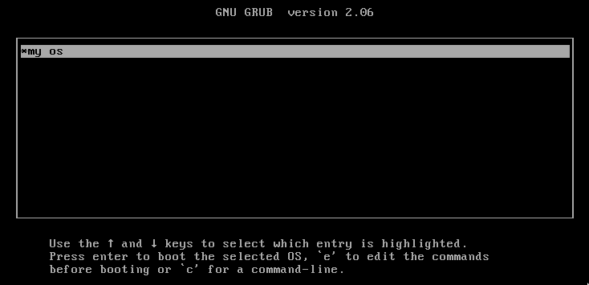
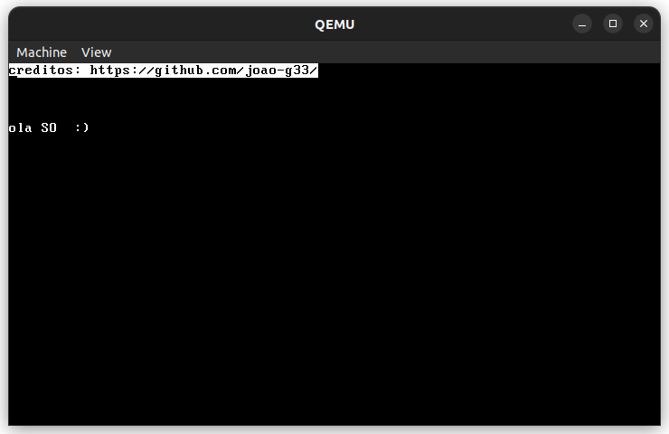
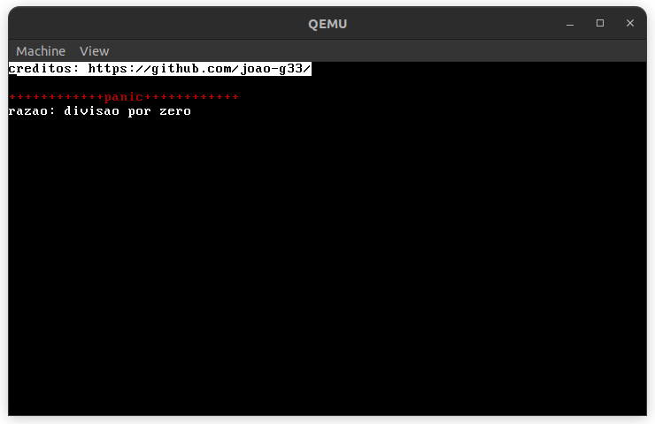

# sistema operacional
antes de tudo, devo esclarecer que este "sistema operacional" não passa de um kernel simples com algumas funções:
<ul>
    <li>escreve na memória de video VGA</li>
    <li>incializa a Global Descriptor Table (GDT)</li>
    <li>incializa a Interrupt Descriptor Table (IDT)</li>
    <li>mapeia instruções</li>
    <li>habilita o uso de um teclado</li>
</ul>
este "sistema operacional" conta com poucas funções pelo fato de que este foi o meu primeiro projeto na área de OSdev, portanto, está limitado ao conhecimento que eu tinha na época de sua criação (meio do ano 2021).

# comandos

**para compilar:**
```
make
```

**para abrir a imagem em uma maquina virtual usando Qemu:**
```
qemu-system-i386 -debugcon file:so.log -cdrom ./build/iso/os.iso
```

**para criar uma mídia bootavel com a imagem:**
```
sudo dd if=./build/iso/os.iso of=/dev/sdx
```

<br>
<br>
<br>

# imagens






